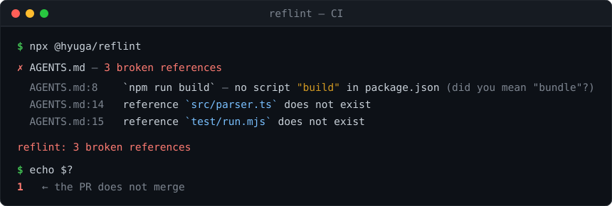

# reflint



> One of three zero-dependency linters for AI-agent repos. To run all three in a single pass, with one report and one exit code, use **[tenken](https://github.com/hyuga611/tenken)** — `npx @hyuga/tenken`.

[](https://www.npmjs.com/package/@hyuga/reflint)
[](LICENSE)
[](package.json)

**In any language, fail the PR when your `AGENTS.md`, `llms.txt`, or `CLAUDE.md` points at a command, script, or path that no longer exists.**
`reflint` is a *reference-integrity* linter for agent config files. It doesn't grade style or prose — it checks whether the references are **real**: the scripts, paths, and files your config tells an AI agent to use. Zero-dependency, language-agnostic, runs in CI on every PR.

**`AGENTS.md` や `llms.txt` の中の「もう解決できない参照」を、どのスタックでも毎PRで落とす。**
AIエージェント向け設定ファイルの **参照整合性 (reference integrity)** を CI で検証するリンタ。表記や文体ではなく、AIに渡す **"嘘の指示" そのもの** ── 存在しないコマンド・スクリプト・パス ── を落とす。依存ゼロ・言語非依存。

---

## Why / なぜ

Agent config rots silently. When it tells the agent to run a script that was renamed, or points at a path that was deleted, the agent trusts it and breaks things. `reflint` fails CI before that happens. It checks *facts*, not prose — so it works in any stack (Go, Rust, Python, Ruby, JS…), and it treats `llms.txt` as a first-class target, which the rest of the ecosystem's format validators don't check for real references.

## Use as a GitHub Action / CIで使う（定着の本体）

```yaml
# .github/workflows/reflint.yml
name: reflint
on: [push, pull_request]
jobs:
  reflint:
    runs-on: ubuntu-latest
    steps:
      - uses: actions/checkout@v4
        with: { fetch-depth: 0 }      # needed for the "new in this PR" diff
      - uses: hyuga611/reflint@v1     # auto-detects AGENTS.md / llms.txt / CLAUDE.md
```

Findings show up as inline PR annotations, and the job fails (exit 1) so a stale config can't be merged.

### Adopting it on an existing repository / 既存リポジトリに後から入れる

A document that has been edited for a year usually has some stale references already. If the first
run turns the PR red, the linter gets removed — so on `pull_request` reflint fails only on
references **this PR broke**, and reports the rest as a count:

```
reflint: 1 new since origin/main broken reference (12 pre-existing, not failing this run — run without --since to see them)
```

"Broke" is judged against the base commit's tree, so it catches both editing a document to point at
something that isn't there **and** deleting a file that a document still points at.

```yaml
      - uses: hyuga611/reflint@v1
        with:
          since: ''      # default: the PR base on pull_request
          # since: off   # check every reference, every time (the old behaviour)
```

## Use as a CLI / ローカルで使う

```bash
npx @hyuga/reflint            # AGENTS.md / llms.txt / CLAUDE.md を自動検出
npx @hyuga/reflint docs/AGENTS.md llms.txt
npx @hyuga/reflint --code-blocks   # ```コードブロック``` 内の、囲みの無いコマンド引数も検査（opt-in）
npx @hyuga/reflint --format json   # 機械可読な JSON 出力（エディタ拡張・他ツール連携の下地）
npx @hyuga/reflint --ignore llms-full.txt,docs/legacy.md   # 個別に無視（カンマ区切り・REFLINT_IGNORE でも可）
npx @hyuga/reflint --since origin/main   # このPRで新しく壊れた参照だけで落とす（既存の債務は件数だけ報告・REFLINT_SINCE でも可）
# npm i -g @hyuga/reflint すると `reflint` コマンドで使えます
# monorepo では、対象ファイルに最も近い package.json の scripts を自動で参照します
```

What it catches:
- **Markdown link targets** (`[text](path)`) in `llms.txt` / `AGENTS.md` that point at repo files which don't exist — the llms.txt referential-integrity check nobody else does in CI
- Back-quoted paths/files that don't exist on disk — **language-agnostic** (works in any repo)
- `npm run <script>` / `pnpm <script>` etc. that isn't in `package.json` (suggests the nearest name) — for JS repos
- Exit code 1 when anything is wrong = a CI gate

What it deliberately **doesn't** flag — a linter is abandoned after one false positive, so precision wins over recall:
- Bare format names in prose (`AGENTS.md`, `llms.txt`, `CLAUDE.md`, `SKILL.md`, `README.md`, `.cursorrules`…). Writing *about* the format isn't a reference. Qualify it with a directory (`docs/llms.txt`) and it's checked again
- Absolute paths, drive letters, globs, `<placeholders>`, URLs, and slash-commands
- Anything you pass to `--ignore`

## textlint と併用 / textlint rule (experimental)

Already run [textlint](https://textlint.org/) over your docs? reflint ships a textlint-compatible rule at `@hyuga/reflint/textlint-rule`, so you can fold the referential-integrity check into your existing textlint pass instead of adding a separate CI step.

```js
import { TextlintKernel } from "@textlint/kernel";
import markdown from "@textlint/textlint-plugin-markdown";
import reflint from "@hyuga/reflint/textlint-rule";

const kernel = new TextlintKernel();
await kernel.lintText(text, {
  ext: ".md",
  plugins: [{ pluginId: "markdown", plugin: markdown }],
  rules: [{ ruleId: "reflint", rule: reflint, options: { codeBlocks: false } }],
});
```

`markdown-link-check` checks whether *external links are alive*; reflint checks whether *repo-relative references resolve*. They're complementary — run both.

## Roadmap

- [x] Reference-integrity core: file paths (any language) + npm scripts (zero-dep) — `src/check.mjs`
- [x] **GitHub Action** (`action.yml`) + inline PR annotations + self-CI
- [x] `llms.txt` markdown-link referential integrity — repo-relative link targets must resolve (the wedge no one else covers in CI)
- [x] Paths inside fenced code blocks — opt-in `--code-blocks`. A path written as a runnable command
      argument carries no backticks and no link syntax, so the default scan cannot see it at all.
      Measured on 80 skills across 4 repositories: reporting every extension-bearing path in a fence
      gave 133 findings for 1 real defect, so the rule now requires a command-shaped line and drops
      bare filenames, template blanks, declared naming patterns, output locations and anything after
      a `cd` out of the repository — 2 findings, 1 real. Stays opt-in: a reference into a sibling
      repository the document exists to describe is not separable from a dead one (see CHANGELOG 0.9.0)
- [x] textlint rule adapter (`@hyuga/reflint/textlint-rule`, experimental) — reuse reflint inside an existing textlint pass
- [x] `--format json` machine-readable output + monorepo resolution (nearest `package.json`, path found from the file's dir or repo root)
- [x] Precision pass — prose mentions of format names no longer flagged, plus `--ignore` / `REFLINT_IGNORE` as an escape hatch

## Dev

```bash
node --test                 # unit tests
npm run poc                 # サンプル(意図的に不整合)で検出デモ → exit 1
node src/check.mjs          # このリポジトリ自身の AGENTS.md を検査 → exit 0
```

## Related tools

Zero-dependency CI linters for repos where AI agents do the work. Each one fails the PR on something that breaks quietly.

| | Catches |
| --- | --- |
| **[tenken](https://github.com/hyuga611/tenken)** — start here | Runs reflint + skills-lint + carrylint over one tree: one report, one exit code, one Action |
| **reflint** ← you are here | `AGENTS.md` / `llms.txt` / `CLAUDE.md` pointing at commands, scripts, or paths that no longer exist |
| [skills-lint](https://github.com/hyuga611/skills-lint) | `SKILL.md` broken references + `name`/trigger collisions between skills |
| [carrylint](https://github.com/hyuga611/carrylint) | Skills with the author's machine or model baked in — absolute paths, undeclared CLIs, unresolved placeholders |
| [genchi](https://github.com/hyuga611/genchi) | Agents reporting "done" without re-fetching real-world state |
| [tracklint](https://github.com/hyuga611/tracklint) | Forms and CTAs that quietly stopped being wired for conversion tracking |
| [tokenlint](https://github.com/hyuga611/tokenlint) | Hardcoded colors that bypass your design tokens |
| [reflint for VS Code](https://github.com/hyuga611/reflint-vscode) | The same reflint checks, inline in the editor as you save |
| [orogami](https://github.com/hyuga611/orogami) | Not a linter — natural Japanese/CJK line breaking for OGP images (BudouX + font subsetting) |

MIT
